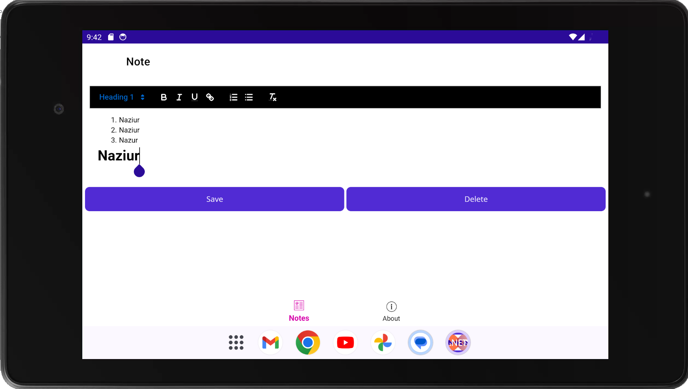
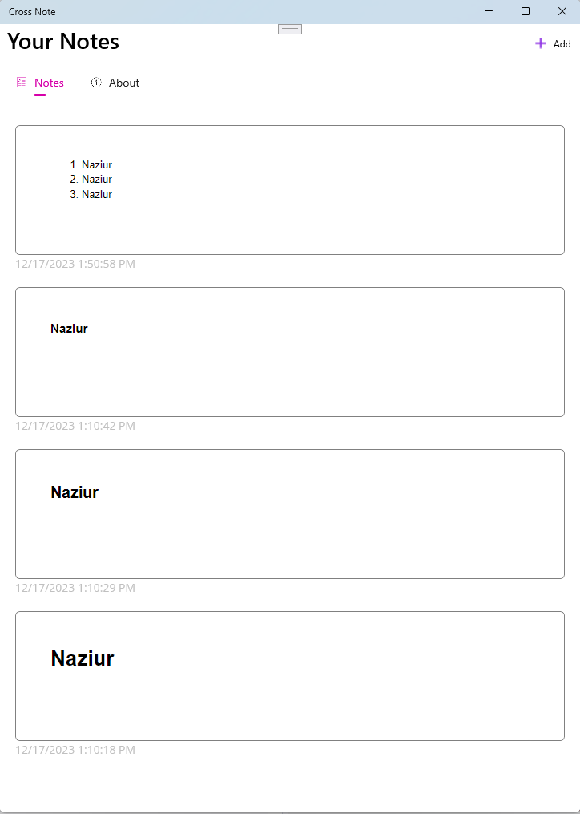

# Cross Note

Cross Note represents a .NET MAUI sample app showcasing a robust text editor feature, a component currently absent in MAUI's native capabilities. DotNET MAUI stands as a powerful framework for crafting cross-platform applications using your preferred DotNET library. While the framework continues to evolve, a notable gap existed in the form of a native rich text editor. To address this, I leveraged [Quill.JS](https://quilljs.com/) to integrate this essential feature into MAUI. I trust that exploring this repository will prove engaging and enlightening.

In place of Quill.JS, one can use TinyMCE, and CKEditor to add some more advanced editor features.

# 🚀 Features

1. Manage your notes (Basic CRUD opration)
2. Use Rich Text Editor to edit your notes (Available for all platforms: Android, Ios, Windows)
3. An innovative workaround to enable Rich Text Editor with the help of MAUI webview & [Quill.JS](https://quilljs.com/)

# ⬇️ Installation

To install Cross Note on your device or emulator/simulator:

1. Clone or download this repository
2. Open the solution file (.sln) in Visual Studio 2022 or later (Visual Studio should include .NET Multi-platform App UI development in the first place, otherwise please follow the instructions from [here](https://dotnet.microsoft.com/en-us/learn/maui/first-app-tutorial/install))
3. Select your target platform and device/emulator/simulator
4. Build and run the app

# ⁉ Support

If you need help with something or have an idea, feel free to start a [Discussion](https://github.com/NaziurRahman1312/cross-notes/discussions). If you have detailed repro steps, open an [issue here instead](https://github.com/NaziurRahman1312/cross-notes/issues).
